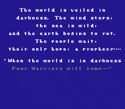
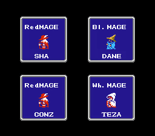
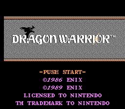
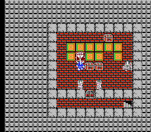

# 🐉 Bigram NES

  

 

This project explores simple bigram-based name generation models running on NES hardware.

The NES only has **2KB RAM** and usually a **128KB ROM** for the code. What AI can we fit in there?

The project includes three subprojects:

- 🍦 [**Vanilla Model**](./vanilla) — a standalone name generator that runs on an NES ROM
- 🧙 [**Final Fantasy: The AI Roster**](./ff1) — a ROM hack that integrates the AI generator in the FF1 name screen
- 🐲 [**Dragon Warrior: NameGen**](./dw) — same for the DW name entry screen (8 characters!)

Each subfolder contains its own README with instructions for building and usage.

Here's a [video](https://youtu.be/pZTwpNlM-Ko) of the romhacks running on real hardware! (courtesy of [@lucentw](https://lucy.gq/))

## ⚙️ Requirements

- [`cc65`](https://cc65.github.io/) toolchain
- An NES emulator (e.g. [FCEUX](http://fceux.com/) or [Mesen](https://www.mesen.ca/))
- Legally owned game ROMs of Final Fantasy 1 and Dragon Warrior (NES), US versions

## 📄 License

This project is licensed under the [MIT License](./LICENSE).

It also includes third-party code used under their respective licenses.  
See [NOTICE](./NOTICE) for attribution and licensing details.
